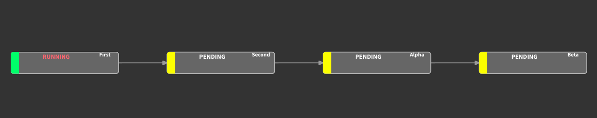

# luigi_practice

luigiの練習


```
cd tasks
sudo luigid --background
python3 run_luigi.py Beta --sec 66
```

## 設定フアイル

タスクごとの設定を書いておくことができる。

* `/etc/luigi/client.cfg`
* `luigi.cfg` という名前でカレントパスに配置
* 環境変数 `LUIGI_CONFIG_PATH`　で指定

```
[First]
param1=hello
param2=world

[Second]
param1=vim
param2=singularity
```

## 外部コマンドの実行

`from luigi.contrib.external_program import ExternalProgramTask` を使うと外部コマンドを実行できるが、パイプやリダイレクトは難しそう。
それらの操作をしたいときのために、 luigiの作者はplumbum モジュールの使用を提案している。(実行できればなんでも良さそうなのでsuprocess使ってもよさそう。)

```
cd tasks
python3 external_luigi.py Beta
```

## 可視化

```
luigid
```

luigidコマンドで可視化のためのサーバを立てた状態でluigiスクリプトを実行する。

デフォルトで http://localhost:8082 で見れる。



